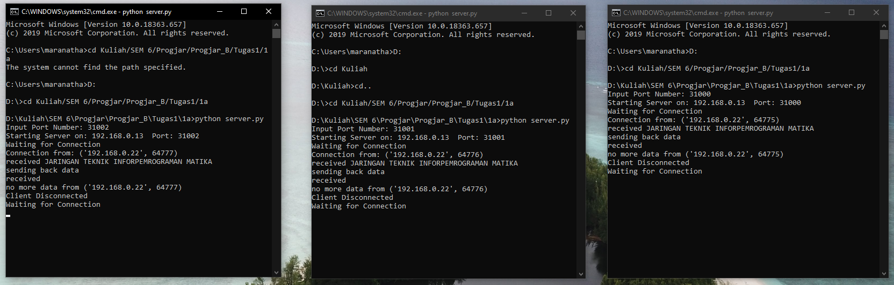
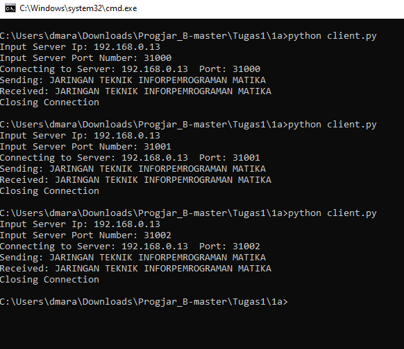
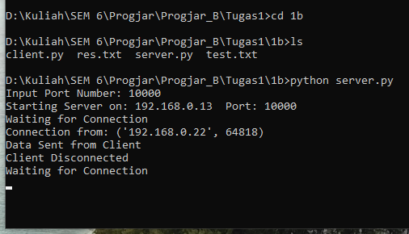
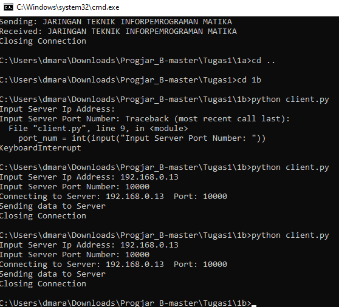
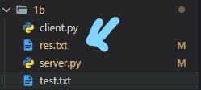
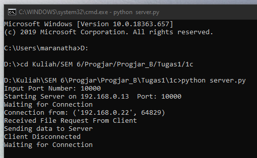
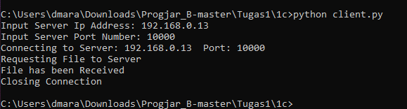
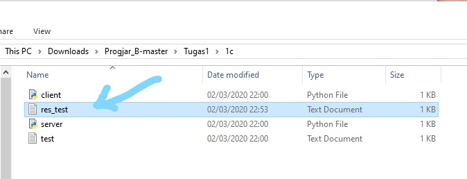

# Tugas 1

### 3 Server di Port berbeda di Komputer Lokal

### 3 Server di Port berbeda di 2 Komputer yang berbeda

### Mengirim File dari 2 Komputer yang berbeda

### Request File dari 2 Komputer yang berbeda 

