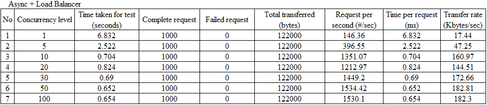
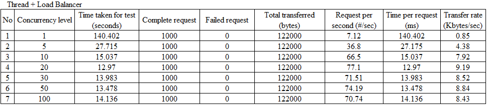
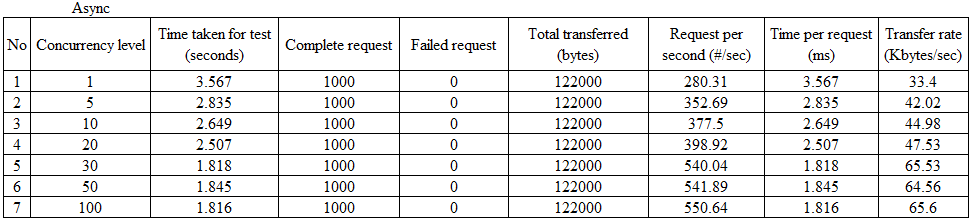
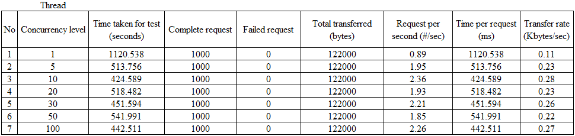
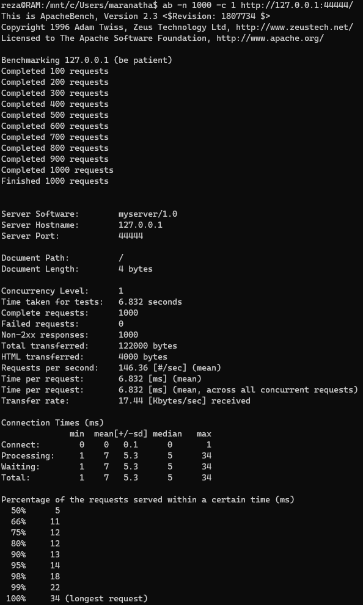
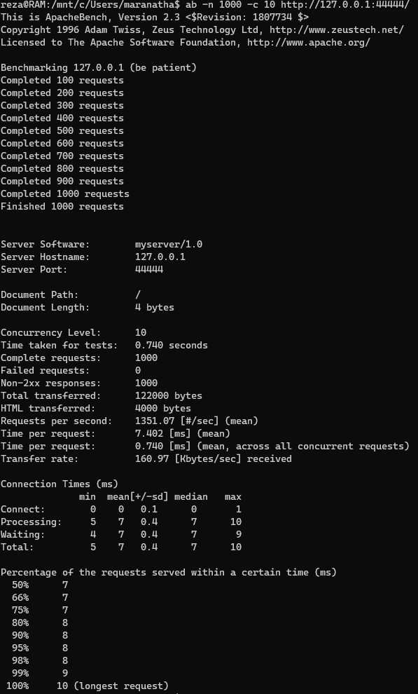
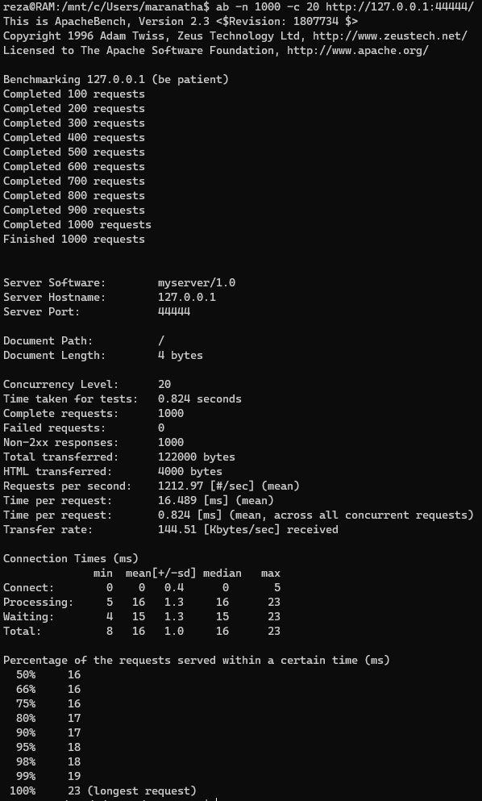
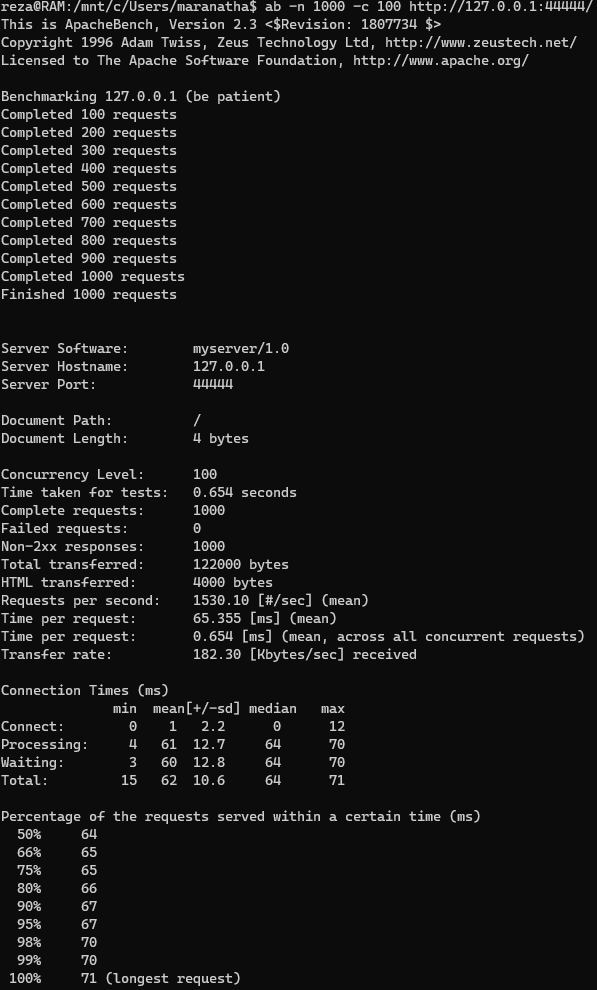
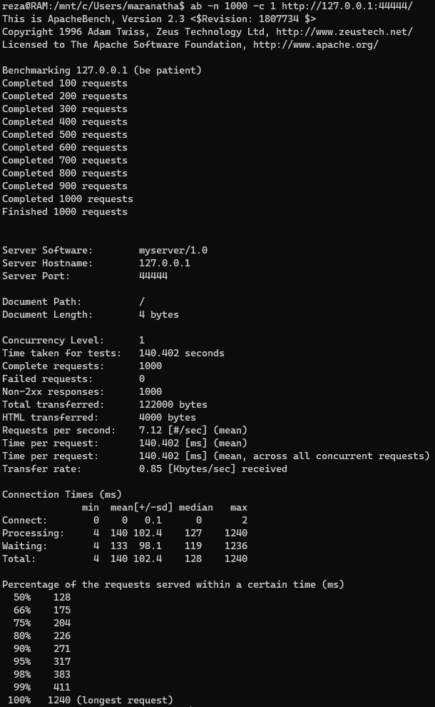
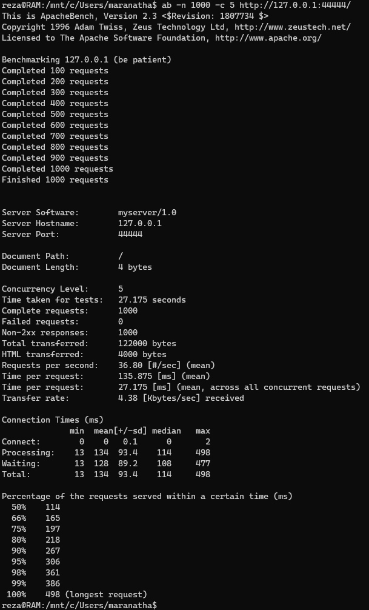

# Tugas 10

## Tabel Stress Test Load Balancer vs Asynchronous vs Threaded Server

### Async Server dengan Load Balancer

### Thread Server dengan Load Balancer

### Async Server tanpa Load Balancer

### Thread Server tanpa Load Balancer

## Hasil Stress Test Apache-Benchmark Async Server dengan Load Balancer 1000 Request

### Concurrency 1

### Concurrency 5

### Concurrency 10

### Concurrency 20

### Concurrency 30

### Concurrency 50

### Concurrency 100

## Hasil Stress Test Apache-Benchmark Thread Server dengan Load Balancer 1000 Request

### Concurrency 1

### Concurrency 5

### Concurrency 10

### Concurrency 20

### Concurrency 30

### Concurrency 50

### Concurrency 100

