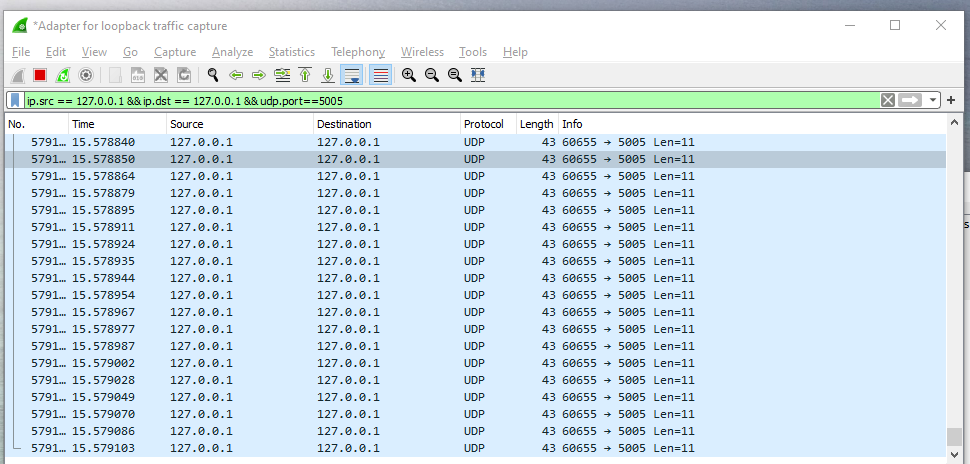
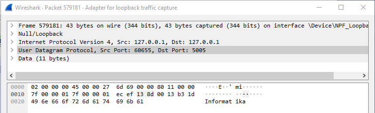
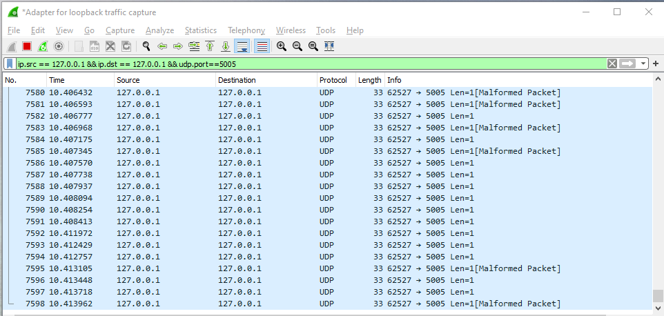
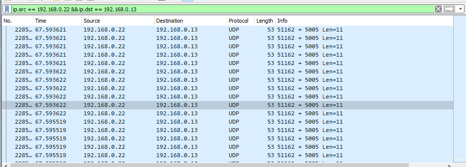

# Tugas 2

### Mengirim menggunakan simple udp dari localhost ke localhost

### Mengirim file menggunakan simple udp dari localhost ke localhost

### Mengirim menggunakan simple udp dari 2 komputer yang berbeda

### Mengirim menggunakan udp file client dari 2 komputer yang berbeda

