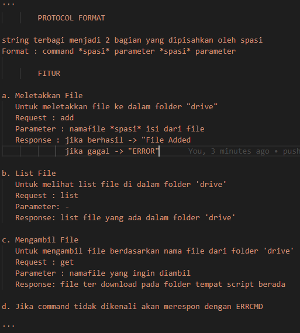
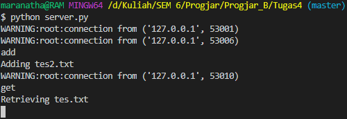
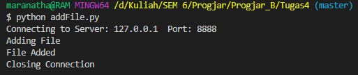
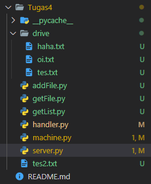
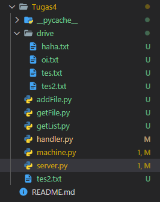
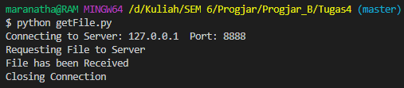
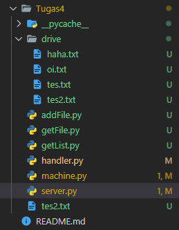
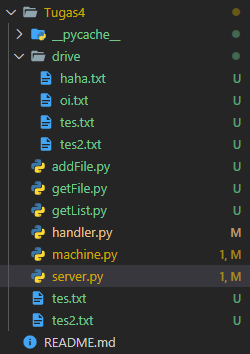
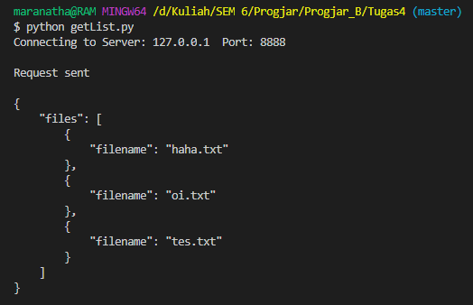

# Tugas 4

## Format Protokol

## Server Responses 

## Meletakkan File 

Sebelum melakukan request (add tes2.txt)  

Setelah melakukan request (add tes2.txt)  

## Mengambil File 

Sebelum melakukan request (get tes.txt)  

Setelah melakukan request (get tes.txt)  

## Melihat List File

