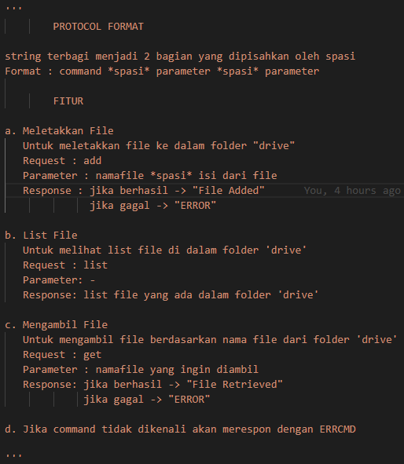

# Tugas 4

## Format Protokol

## Server Responses 

## Meletakkan File 

Sebelum melakukan request  

Setelah melakukan request  

## Mengambil File 

Sebelum melakukan request  

Setelah melakukan request  

## Melihat List File

