# Tugas 9

## Tabel Stress Test Asynchronous & Threaded Server

### Async

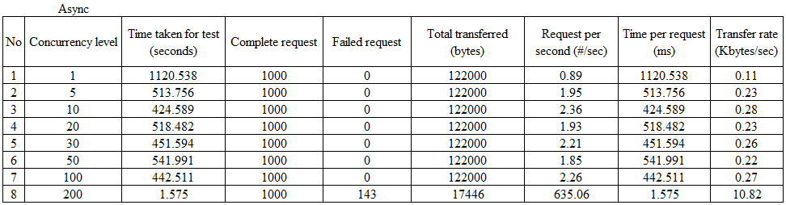

### Thread

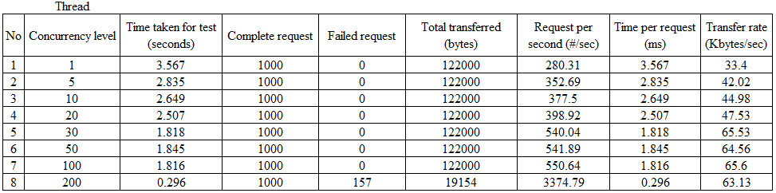

## Hasil Stress Test Apache-Benchmark Asynchronous Server 1000 Request

### Concurrency 1

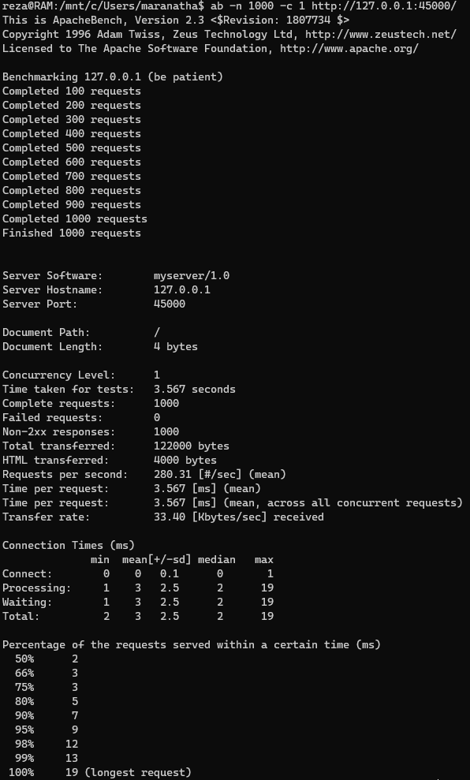

### Concurrency 5

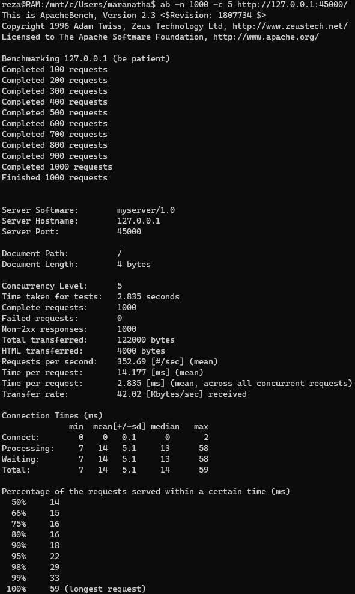

### Concurrency 10

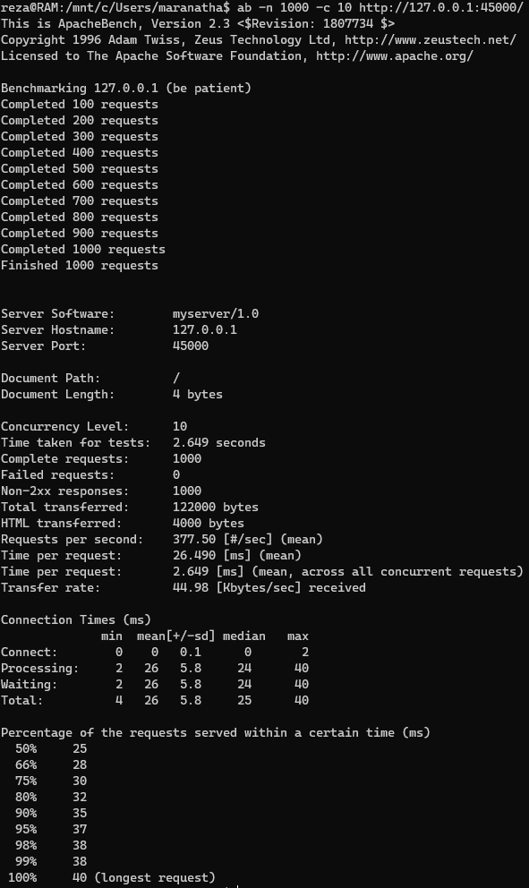

### Concurrency 20

### Concurrency 30

### Concurrency 50

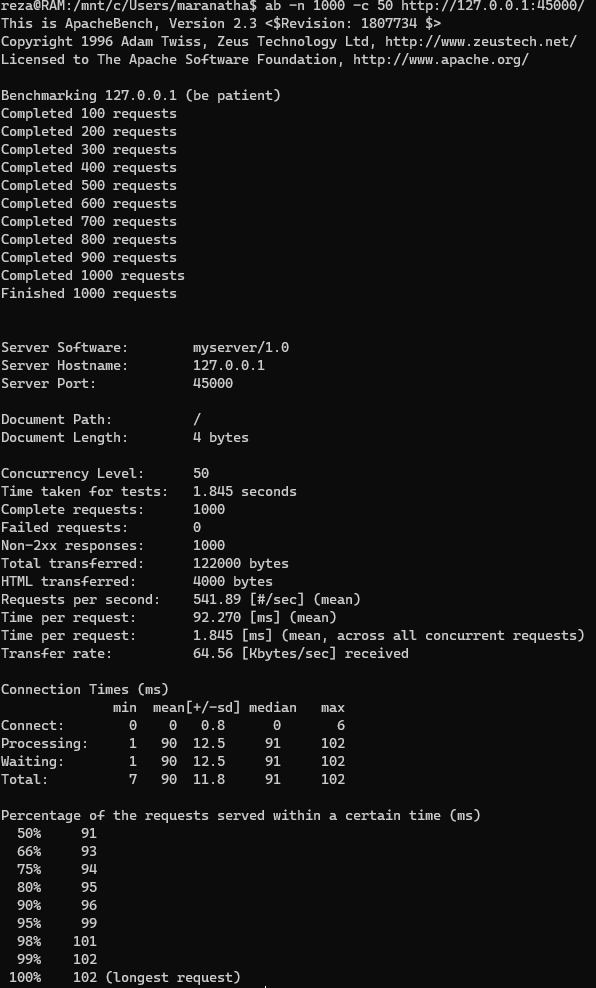

### Concurrency 100

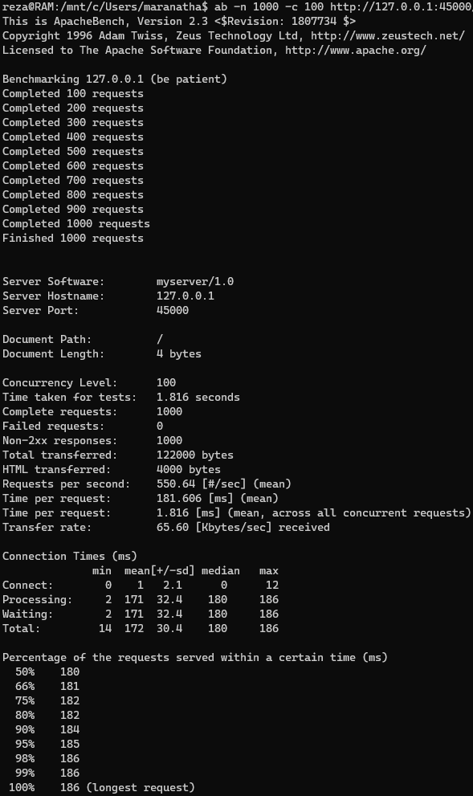

### Concurrency 200

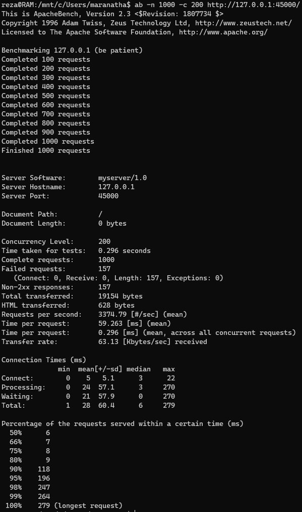

## Hasil Stress Test Apache-Benchmark Threaded Server 1000 Request

### Concurrency 1

### Concurrency 5

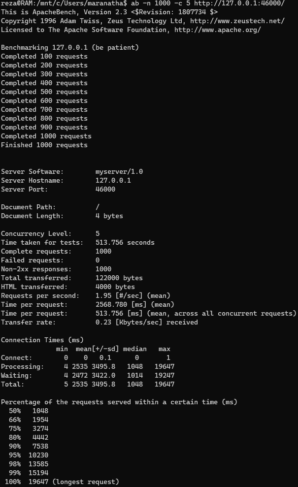

### Concurrency 10

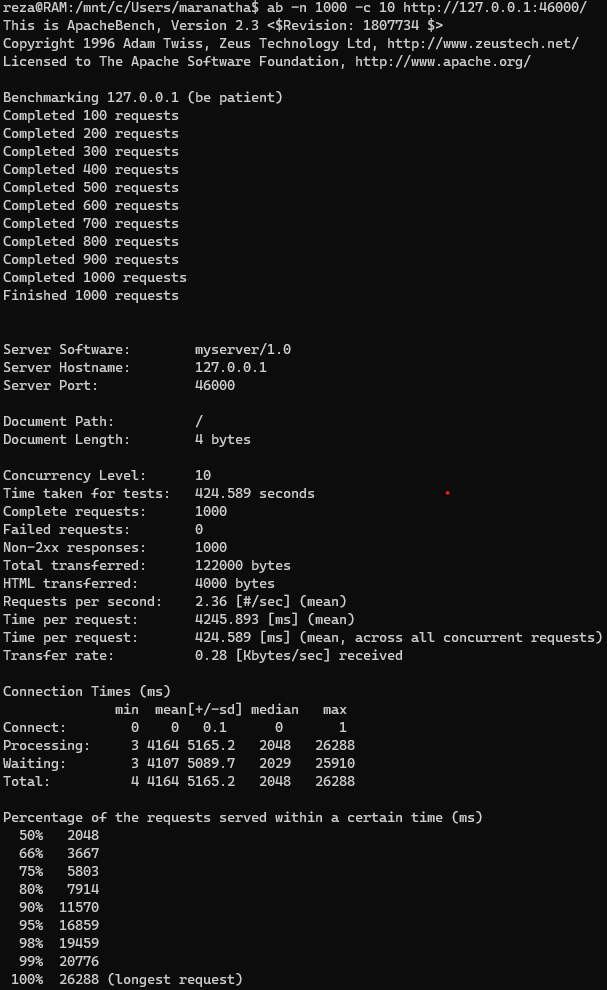

### Concurrency 20

### Concurrency 30

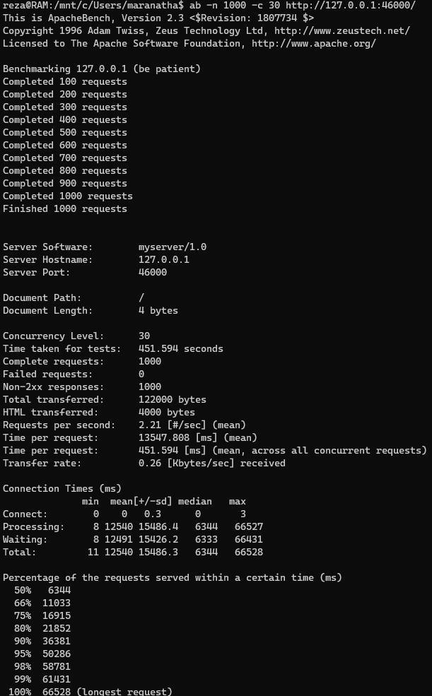

### Concurrency 50

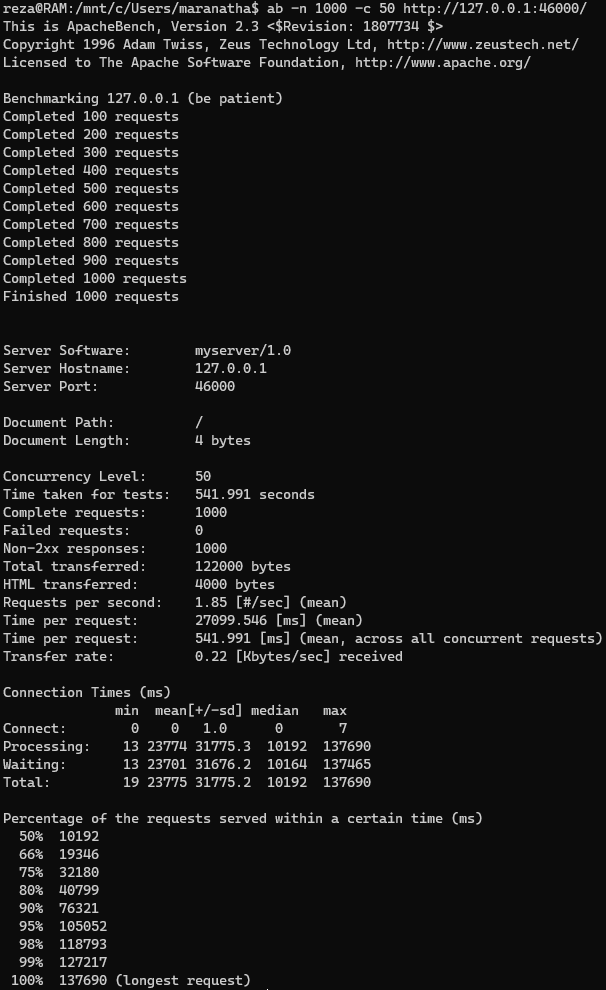

### Concurrency 100

### Concurrency 200

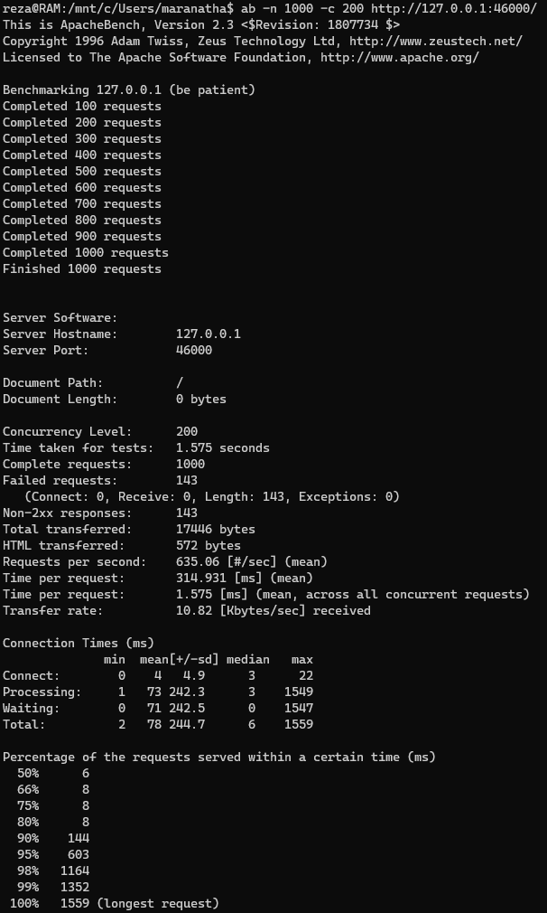
